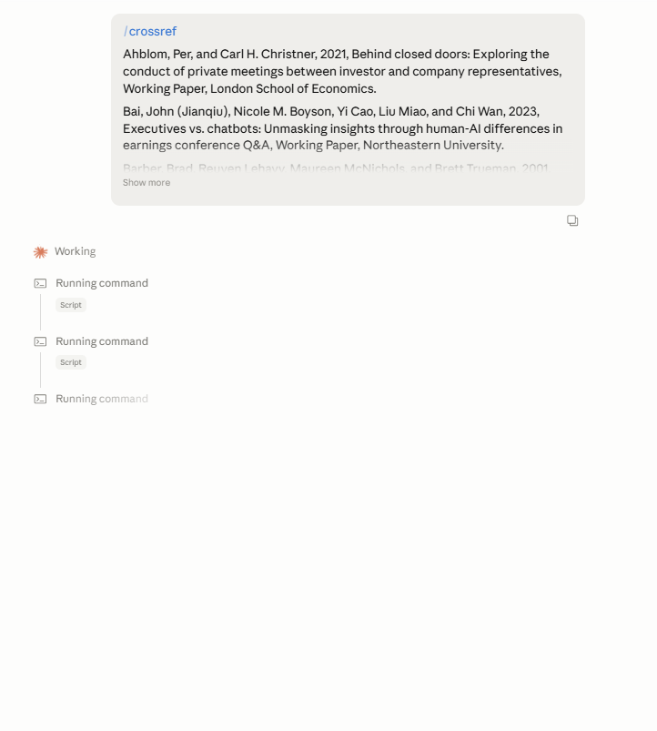
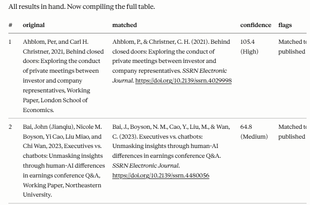

# crossref

A Claude skill that matches a pasted bibliography against the [Crossref REST API](https://api.crossref.org) and returns a markdown table with canonical APA citations, DOIs, match confidence, and diff flags.





## What it does

Paste a reference list. You get back a table like:

| # | original | matched | confidence | flags |
|---|----------|---------|------------|-------|
| 1 | Bebchuk, L. A., Cohen, A., & Hirst, S. (2017). The agency problems... | Bebchuk, L. A., Cohen, A., & Hirst, S. (2017). The agency problems of institutional investors. *Journal of Economic Perspectives*, 31(3), 89–112. https://doi.org/10.1257/jep.31.3.89 | DOI (High) | — |

Handles: DOI-mode lookups, free-text query fallback, SSRN/NBER preprints, likely-miscited references, rate-limited parallel batching.

## Installation

**Claude Code** — clone into your skills directory:

```bash
cd ~/.claude/skills/
git clone https://github.com/jusi-aalto/crossref.git
```

**Claude Desktop** — download the ZIP from GitHub (Code → Download ZIP), then:

1. Go to **Customize → Skills**
2. Click **+**, then **+ Create skill**
3. Select **Upload a skill** and upload the ZIP file

The skill will appear in your Skills list and can be toggled on or off. See [Use Skills in Claude](https://support.anthropic.com/en/articles/12111783-using-skills-in-claude-ai).

## Use

In a Claude conversation, type `/crossref` followed by your reference list, or just paste the list and ask Claude to verify it against Crossref.

Under the hood, Claude calls these Python scripts:

```bash
python scripts/crossref_query.py --doi "<DOI>" --extract
python scripts/crossref_query.py --query "<reference text>" --rows 3 --extract
```

The `--extract` flag returns a compact JSON array of candidate records (score, authors, title, container, year, DOI, …) instead of the full Crossref payload.

## Configuration

Set your email in `scripts/crossref_query.py` under `USER_AGENT` to use Crossref's [polite pool](https://api.crossref.org/swagger-ui/index.html#/Etiquette) (higher rate limits, better support).

## License

MIT.
