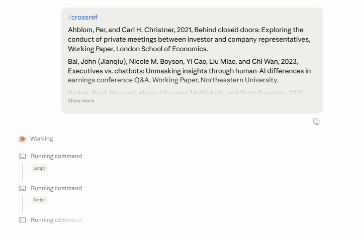

# crossref

This repository contains both a **Google Chrome Extension** and a **Claude Skill** that matches a pasted bibliography against the [Crossref REST API](https://api.crossref.org) and returns canonical APA citations, DOIs, match confidence, and diff flags.

## Chrome Extension

We have ported the core citation-checking functionality into a fully standalone modern Chrome Extension! Now you can easily verify citations in bulk straight from your browser. *Designed and developed by Nitin Shukla & Google DeepMind's Antigravity AI.*

### Key Features
* **Select & Check**: Highlight a citation on any webpage, click the extension, and it automatically captures your selection.
* **Smart Bulk Processing**: Paste a massive list of references. The extension auto-splits them, filtering out noise, and queries them sequentially to prevent heavy API rate-limiting!
* **Background Processing & Memory**: Checking occurs via a background service worker. If you close the popup to look at another tab, it doesn't interrupt the process! Your completed results are safely saved to local storage so they are waiting for you when you return.
* **Export to CSV**: One-click download of all validated TOP references into a neat CSV spreadsheet for easy organizing.

### Installation && Configuration
1. Clone this repository locally.
2. Open Google Chrome and type `chrome://extensions/` in your URL bar.
3. Toggle on **Developer mode** in the top right corner.
4. Click **Load unpacked** and select the `/extension` directory inside this repository.
5. Pin the **Crossref Citation Checker** extension to your toolbar and click it to start checking citations! 
*(No API Keys are necessary since it seamlessly uses the Crossref REST API via fetch)*

---

## Claude Skill (Python)

A Claude skill that matches a pasted bibliography against the Crossref API.

| Invoking `/crossref` on a pasted list | Resulting table with DOIs, confidence, flags |
|---|---|
|  |  |

### Quickstart

Paste your reference list and the invoke with `/crossref`. You get back a table like:

| # | original | matched | confidence | flags |
|---|----------|---------|------------|-------|
| 1 | Bebchuk, L. A., Cohen, A., & Hirst, S. (2017). The agency problems... | Bebchuk, L. A., Cohen, A., & Hirst, S. (2017). The agency problems of institutional investors. *Journal of Economic Perspectives*, 31(3), 89–112. https://doi.org/10.1257/jep.31.3.89 | DOI (High) | — |

Handles: DOI-mode lookups, free-text query fallback, SSRN/NBER preprints, likely-miscited references, rate-limited parallel batching.

### Installation

**Claude Code** — clone into your skills directory:

```bash
cd ~/.claude/skills/
git clone https://github.com/jusi-aalto/crossref.git
```

**Claude Desktop** — download the ZIP from GitHub (Code → Download ZIP), then:

1. Go to **Customize → Skills**
2. Click **+**, then **+ Create skill**
3. Select **Upload a skill** and upload the ZIP file
4. Go to **Settings → Capabilities → Additional allowed domains** and add `api.crossref.org`. Without this, the skill's first API call fails with `HTTP 503` or `DNS cache overflow`.

The skill will appear in your Skills list and can be toggled on or off. See [Use Skills in Claude](https://support.anthropic.com/en/articles/12111783-using-skills-in-claude-ai).

### Configuration

Set your email in `scripts/crossref_query.py` under `USER_AGENT` to use Crossref's [polite pool](https://api.crossref.org/swagger-ui/index.html#/Etiquette) (higher rate limits, better support).

## License

MIT.
